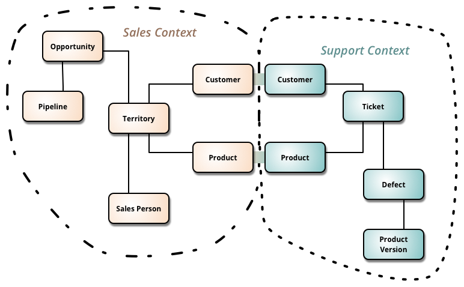

# Domain-driven design (DDD)

Every software is based on a specific domain. Only by eliciting requirements, you can understand it. If well designed, the architecture reflects the domain.

That's when **Domain-driven Desing (DDD)** comes in handy!

What are the basics of DDD? 

First things first, we should not be alone in our job: among the different stakeholders, we need a **Domain Expert (DE)** that has expertise in that domain. The more we communicate with the Domain Expert, the more detailed our knowledge of the domain is.

But there's a problem: what if the DE uses some terms that are not shared with the dev team?

Like, for the DE, a video is a *Clip*, but for the devs, it is called *Video*.

The communication - and the docs - become a mess; that's why we need **Ubiquitous Language (UL)**. 

UL simplifies communication and improves the domain understanding among every team member. We should use it in docs, code, tests, diagrams... everywhere! Of course, it may evolve as we understand better the domain 🐒

## Entities, Value Objects, Aggregates

In DDD there are 3 fundamental blocks: 

🔸Entities
🔸Value objects
🔸Aggregates

What do they mean?

### Entities

Entities **are objects defined by their identity** and not their attributes

Think of the `User(id, username, age)` object.

`(1, Davide, 29)` and `(573, Davide, 29)` have the same attributes, but a different ID. Thus they are 2 different entities.

This means that **Entities are mutable**: you can update the second user as `(573, Davide, 45)`, but since the ID is the same, it represents the same object.

### Value Objects

They are the opposite of Entities: **objects are not defined by their attributes** rather than by an ID.

Think of a Cloudinary-like `Image(URL, width, height)`

It's the combination of its attributes that define the Object. If you change its height, the image will be another one.

### Aggregates

Aggregates are groupings of Entities and Value objects, **treated as a single object**.

Think of `UserProfile(User, Image)`.

Aggregates simplify how we manage complex objects!

Even with Entities, Value Object, and Aggregate, complex domains can be difficult to manage: we will need to split the domain into smaller parts!

## Subdomains and Bounded Contexts

Say that you're developing an e-commerce website; many parts work together:

- product search
- sellers registration
- order tracking
- user management

Too much for a single domain!

That's why, in DDD, there is the concept of SubDomain

### Subdomains

Subdomains are a way to reduce the complexity of an application by **splitting the domain into smaller, easier-to-work domains**.

Each subdomain is focused on a single aspect of the application.

**Core domains** are one or more subdomains that are core assets for your organization. Without them, your application has no reason to exist - because you can simply use someone else's product. They are what differentiate your product from those of your competitors.

An example of a Core Domain in an e-commerce website is the Search functionality: having a specific set of filters and rules that allow your company to return better results may be the key to your success.

So, now we have smaller Domains. But we have not organized our Domain models.

### Bounded Contexts

Entities, Aggregates, and Value Types represent the whole Domain Model, which can be separated by using Bounded Contexts.

An analogy you might want to remember:

> Domain:SubDomain=Domain Model:Bounded Context

They are just partitions of the "bigger" structure.

But, even if similar, **there's not always a 1:1 correlation** between a SubDomain and a Bounded context.

The domain model for a subdomain may spread across multiple bounded contexts.

Like in the *Order Tracking* subdomain: we can have a context that relates to the exact tracing of the items, and one that relates to how the user sees the status.

Say that we have the *Shipping* object.

For the *ReportContext* (the one for the users), it has some fields (eg: [ID, Status, ExpectedArrival])

For another context, like *DeliveryContext*, it has some other fields: [ID, CurrentGpsPosition, LorryID]

The same object *Shipping* lives in 2 different contexts and has 2 different meanings.

That's a great example of SRP: the 2 Shipping classes will evolve in different ways, so it's best to keep them separated instead of putting every field in the same object.

To simplify:

> SRP > DRY 

It's better to duplicate code if it has different meanings rather than putting it all together and creating messy classes.

In this picture by Martin Fowler, we can see 2 contexts: Sales Context and Support Context

They are about different things but have some stuff in common: Customer and Product.

The different representations of Customers and Products are free to evolve independently.

## Wrapping up

👨‍🏫 Domain Expert: who know everything about the domain

🗣 Ubiquitous language: shared terms to simplify communication

💳 Entities: Different IDs -> different objects

👯‍♂️ Value Objects: different Attributes -> different objects

🏗 Aggregates: Entities + Value Objects

🪓 We can separate our Domain into different SubDomains, as well as we can separate our Domain Model into different Bounded Contexts.

👫 Not always there is a 1:1 relationship between Subdomains and Bounded Contexts.

🍱 Separating things well allow you to focus on different aspects of your application without impacting the others.
