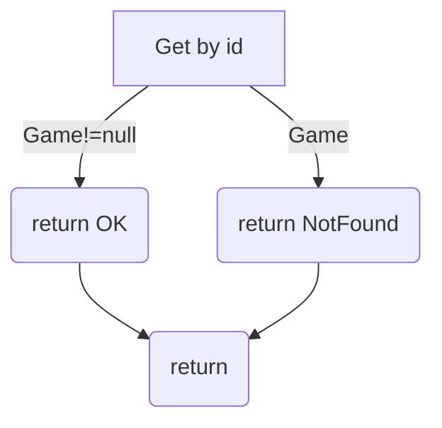
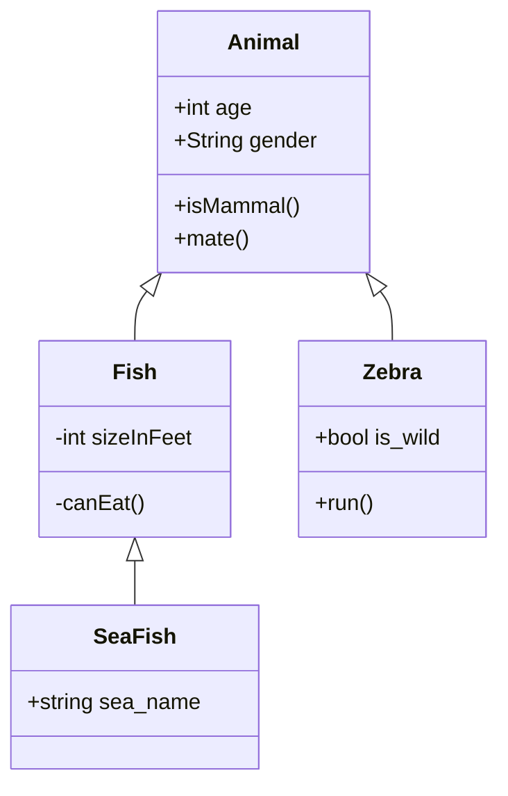

# Software quality attributes: Maintainability

Maintainability is the architectural attribute that describes how easy it is to maintain a software system.

- Why is Maintainability important?
- What are the types of maintainability?

## Introduction

Software systems become stale quickly: if you don't maintain them with the necessary adjustments, your products will lose value.

Of course, unless you're writing a throwaway piece of software that can be discarded after its first use.

Change is inevitable, you should embrace it. You don't always have control over it, but you can perform operations and analyses that help you maintain the project with ease.


Easy-to-maintain code has many advantages:

- quicker (and less expensive) maintenance operations
- easy to reverse-engineer
- oriented to the other devs, not only to the customers
- keeps the system easy to update if the original devs leave the company 

A system can require maintenance for several reasons, so there are several categories of software maintenance:

- Preventive
- Corrective
- Adaptive
- Perfective

🧢 Preventive Maintenance 🧢

Prevents maintenance problems in the future

🔹 Improve the quality of the software
🔹 Examples are: refactoring complex components, structuring better the project


🕵️‍♂️ Corrective Maintenance 🕵️‍♂️

Helps analyze defects in the code

🔹 Measured by the time spent for analyzing+fixing a defect
🔹 A priority can be assigned to defect: Blocker (P0), Critical (P1), High (P2), Medium (P3), Low (P4)
🔹 P0/P1 items are the first ones to be addressed


🐒 Adaptive Maintenance 🐒

It's about how difficult it is to adapt the software to a new system, like

🔹 different OS
🔹 different Cloud provider
🔹 different DB provider


⚙ Perfective Maintenance ⚙

Allows adding or updating requirements:

🔹 generally, functional requirements
🔹 can be referred to non-functional requirements, like performance, availability

The higher the level of maintainability, the easier (and the cheaper) is the update.


Taking care of all those kinds of maintenance helps the system thrive.

A good architecture that allows you to easily maintain and improve your software is key for the software's future.


In the next thread, we will see how to measure maintainability and how to improve it.


To recap, we have 4 types of maintainability to take care of:

🧢 Preventive: prevent future troubles
🕵️‍♂️ Corrective: fix defects
🐒 Adaptive: adapt to new systems
⚙ Perfective: improve existing software

## How to measure it?


### Lines of code (LOC)

Typically, systems with more LOC are more complex and, therefore, harder to maintain. Of course, it's the order of magnitude of that number that tells us about the complexity. 90000 and 88000 are similar numbers, you won't see any difference.


You will not count LOC manually - of course! IDEs and tools can do it for you.

There are two types of LOC that can be calculated:

**Physical**: Count everything. Easier to calculate.

**Logical**: Count only effective lines of code. Ignore spacing and imports.


Take this method as an example:

```cs
// GET api/<BoardGameController>/5
[HttpGet("{id}")]
public async Task<ActionResult<BoardGame>> Get(int id)
{
    // Fetch db to get board game by ID
    var game = await _boardGameRepository.Get(id);

    if (game != null)
        return Ok(game);
    else
        return NotFound();
}
```

The value of the Physical LOC is 12; even comments and empty lines are used to calculate this metric.

But the Logical LOC value is 3; only 3 lines of code are executed: the Get method, and the 2 Return statements.

### Cyclomatic complexity (CC)

It measures the number of linear paths through a module.

This formula works for simple programs and methods:

> CC = E-N+2

where

**E**: Edges of the graph
**N**: Nodes of the graph

Wait! Graph??

Code can be represented as a graph, where each node is a block of code.

Take as an example the Get method we've seen before.

We have 4 nodes (N=4) and 4 edges (E=4), so

CC = 4-4+2 = 2



Again, you will not calculate CC manually: there are plenty of tools that can do it for you.


### Depth of inheritance tree (DIT)

DIT is specific to OOP. It measures the max level of inheritance.

In the following example, the max level is 2.





🔼 High DIT value? A more complex system, but with reusable parts (since even attributes are inherited)

🔽 Low DIT value? A simpler system, with low code reuse.


We should not keep the DIT value always to the minimum. But if we see that the value becomes too high, we should investigate the reasons behind it.
